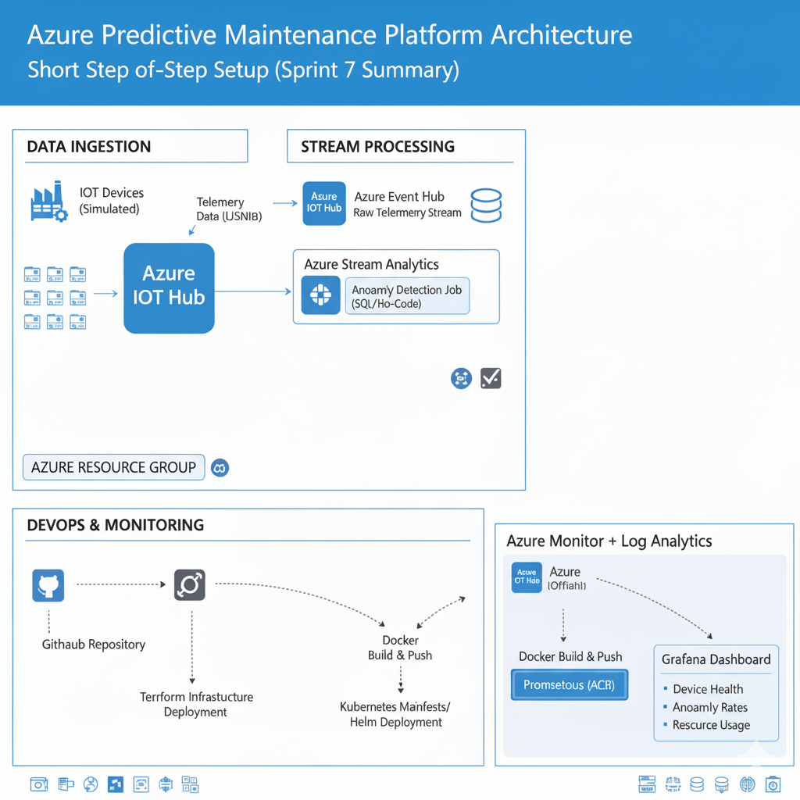
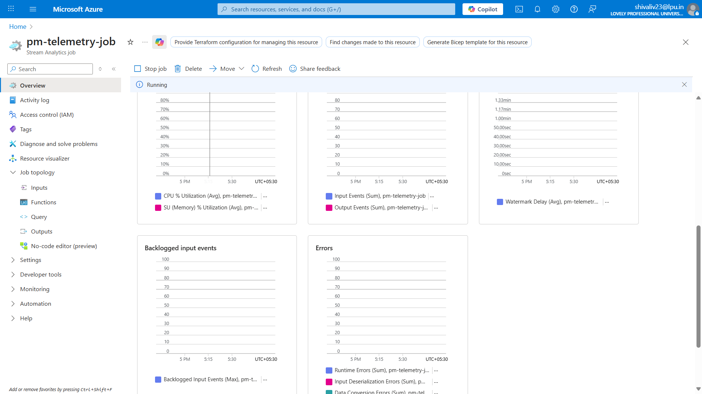
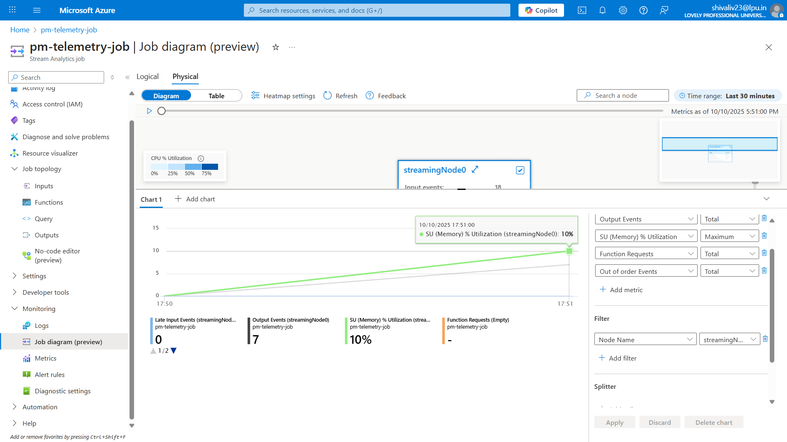
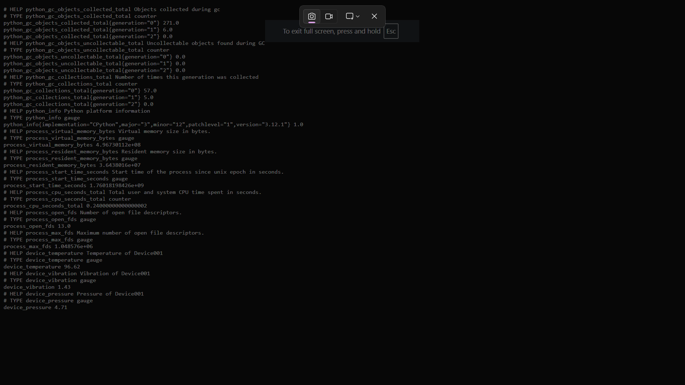

# Predictive Maintenance IoT Platform (Azure)

## 🚀 Project Overview

The **Predictive Maintenance IoT Platform** is an end-to-end **Azure-native solution** designed to simulate IoT device telemetry, process real-time streaming data, detect anomalies, trigger alerts, and visualize device health.

It demonstrates **Cloud, IoT, Machine Learning, and DevOps integration** — providing a production-style workflow for predictive maintenance scenarios in industries like manufacturing, energy, or logistics.  

> **Real-Life Example:**  
> Imagine a factory with hundreds of machines. Each machine is equipped with sensors monitoring temperature, vibration, and operating hours. This platform can **predict machine failure** before it happens, allowing maintenance teams to act proactively, reducing downtime and saving costs.

---
###  Arcitecture Diagram

## 📈 How It Works

1. **IoT Device Simulation**
   - Python scripts simulate device telemetry (temperature, vibration, pressure, etc.)
   - Data is sent in JSON format to **Azure IoT Hub**

2. **Real-Time Stream Processing**
   - Azure Event Hub collects streaming telemetry
   - Stream Analytics detects anomalies (e.g., temperature > threshold)
   - Alerts are triggered automatically

3. **Alerting System**
   - **Azure Functions** process events and send notifications:
     - Teams messages
     - Email alerts
     - Optional API triggers for automated maintenance

4. **Containerization & Deployment**
   - Services (Functions, ML API) are dockerized
   - Images pushed to **Azure Container Registry (ACR)**
   - Deployment to **Azure Kubernetes Service (AKS)** for scalable infrastructure

5. **CI/CD Automation**
   - GitHub Actions workflows:
     - Build & push Docker images
     - Apply Terraform scripts for infrastructure provisioning
     - Deploy AKS manifests

6. **Monitoring & Visualization**
   - **Prometheus** collects metrics from deployed services
   - **Grafana** dashboards display:
     - Device health
     - Anomaly rates
     - Resource usage
   - Optionally connected with **Azure Monitor** for live telemetry

7. **Machine Learning (Optional)**
   - Train predictive models using **Azure ML** or local Python (scikit-learn/TensorFlow)
   - Deploy as REST endpoints
   - Integrate with Stream Analytics or Function app for real-time predictions

8. **Security & Compliance**
   - Secrets managed using **Azure Key Vault**
   - Role-Based Access Control (RBAC) implemented for resources
   - Network Security Groups (NSGs) ensure secure communication

---
## 📸 Project Screenshots  

|  |  |
| --- | --- |
|  |  |

> These screenshots showcase the step-by-step implementation of the Predictive Maintenance Platform — from IoT data ingestion to visualization dashboards.

## 🧰 Tools & Technologies

**Azure Services:**
- IoT Hub, Event Hub, Blob Storage, Functions, Stream Analytics, ACR, AKS, Azure ML, Monitor, Key Vault  

**DevOps Tools:**
- Terraform (IaC), Docker, GitHub Actions (CI/CD), Prometheus, Grafana  

**Languages & Frameworks:**
- Python, YAML, HCL (Terraform)  

**IDE / Editors:**
- VS Code  

---

## 🏗️ Project Structure

predictive-maintenance-azure/
├── infra/ # Terraform scripts for Azure infrastructure
├── functions/ # Azure Functions & Python code
├── k8s/ # Kubernetes manifests / Helm charts
├── .github/workflows/ # GitHub Actions CI/CD pipelines
├── docs/ # Architecture diagrams, notes, screenshots
└── README.md

yaml
Copy code

---

## ⚡ Quick Start

### 1. Clone the repository
bash
git clone https://github.com/<your-username>/predictive-maintenance-azure.git
cd predictive-maintenance-azure
2. Install Dependencies
bash
Copy code
## Python dependencies
pip install -r functions/requirements.txt

## Terraform
terraform init
terraform plan
3. Simulate IoT Data
bash
Copy code
python functions/iot_simulator.py
4. Deploy Containers & AKS
bash
Copy code
# Build Docker images
docker build -t <image-name> functions/

# Push to Azure Container Registry
docker push <your-acr>.azurecr.io/<image-name>

## Deploy to AKS
kubectl apply -f k8s/
5. Monitor & Alert
Access Grafana at http://localhost:3000

Connect Prometheus for metrics simulation

Optional: Integrate with Azure Monitor for live telemetry

### 🎯 Real-Life Use Cases
Manufacturing: Predict machine failures to schedule preventive maintenance

Energy: Monitor turbines or solar panels for anomalies

Logistics: Predict vehicle breakdowns to minimize delays

Healthcare: Monitor critical medical equipment in hospitals

### 🎥 Demo

IoT simulator sending telemetry data

Alerts triggering in Functions

Grafana dashboards updating in real time

Optional ML model predicting failure risks

Tools for demo: OBS Studio, screen recordings, or GIFs for GitHub docs

### 🔐 Security Considerations
Secrets managed via Azure Key Vault

RBAC ensures correct permissions for users/services

Network Security Groups (NSG) restrict access to resources

Optional vulnerability scanning using Trivy

### 📜 License
This project is licensed under the MIT License.

## 🌟 Outcome
A fully automated, Azure-native predictive maintenance platform demonstrating cloud, IoT, ML, and DevOps mastery — ready for recruiters and portfolio showcase.

## Contributor 

Shivali v
Adharsh .U 
